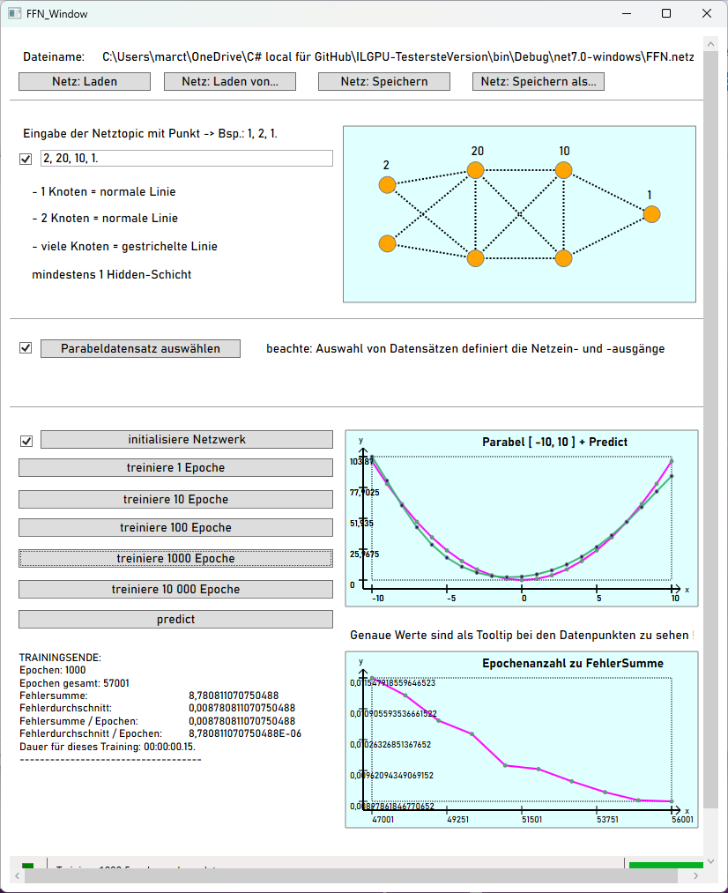

# ILGPU-Test
 Demo program for 'MatrixFFN' and 'ILGPU'

## 0.work in progress

I am sorry for the inconvenience of seeing incomplete software. For that reason you can try the old stable version in .Net 7. You find it in the compressed file  [OldRunningVersion.zip](OldRunningVersion.zip) . 

Here a screenshot of the FFN_Window in action:

## 1.first thoughts

My longtime interest in artificial neural networks is there from the 90s when i did study computer science with this topic as focus theme. While having tried any tool i could get my hands on ( free/professional ) i was never pleased - regression is still an uncharted area today.

With C# life is better and you will see that it is possible to even approximate the **parabel**.

This demo program will show you the <u>**MatrixFFN**-DLL</u>. It includes a feed forward network "<u>**FFN**</u>" and its own window where you can train a network, input its n-hidden layers and see the results.

ILGPU is a big promise for C# and the *<u>**FFN**</u>* is there as *<u>**FFN_ILGPU**</u>*. Feel free to compare the power of both networks with the **parabel** or any data you like.

## 2.background information to the MatrixFFN

Having tried for many years to implement a working network gave me much practice in programming Java and C++. I stumbled over C# and just had to start Microsoft Learn lessons.

With C# anything is better organized and understood than the other languages yet. Multidimensional arrays are like you would think of them with pen & paper. This in mind you can understand that i could solve my years of unsuccessful trying. And it is really easy even to tell.

Math comes in the lessons from vector operations. Next step will be the definition that a matrix is a special case of a vector. Now the big pun comes: the dimension of a matrix is written like a vector's:

- dimension vector_a = ( 2 ) means he is 2 high
- dimension matrix_a = ( 2, 3 ) means it is 2 high and 3 broad ! <u>**And that is wrong**</u> - everyone looking at coordinates tells you x comes first then y but not with mathematicians. Everything is turned around for nothing but to confuse and i wonder what's their gain for it.
- so matrix_a = ( 2, 3 ) would be 2 in xSize and 3 in ySize for people like me. This gave me the turn around for the coding and they could't confuse me any more out of the truth.

Understand that i did achieve at university anything they wanted from me. Analysis 1-4 and Algebra 1-4 plus the feared oral test about it directly. So i wish readers will get it that even if they think my work is great, that i didn't invent something new. 

Coming to the truth the whole weight lies on the **<u>Falk-scheme</u>** to multiply matrixes. Wikipedia is showing it correct which shape happens as result. On the other hand my newly bought **mathematical formula collection** is mixing the indices up for no known reason ( they use Myx as the location information in Matrix M *(see above)* ). This means in my life 20 years of complaints from people like me couldn't change the world, hehe. And i bet no one knows where mathematicians find a value in this behaviour.

Now you understand why i could publish something on GitHub while you could possibly earn money with it.

